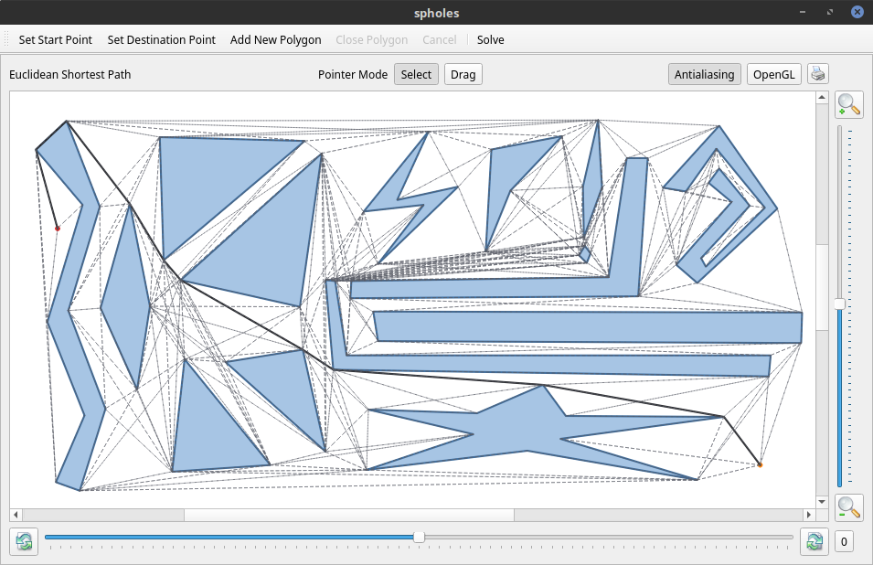

# spholes

This is a 2d [Euclidean shortest path](https://en.wikipedia.org/wiki/Euclidean_shortest_path) solver with a Qt interface.

The algorithm source code is in the `src/spholes` directory. It is based on the $O(n^2 \log n)$ visibility graph algorithm found on the chapter 15 of [Computational Geometry Algorithms and Applications](https://www.springer.com/us/book/9783540779735) book by de Berg, et al, and Dijkstra's algorithm.

To use it just set the start and destination points, add obstacles clockwise and click solve.

